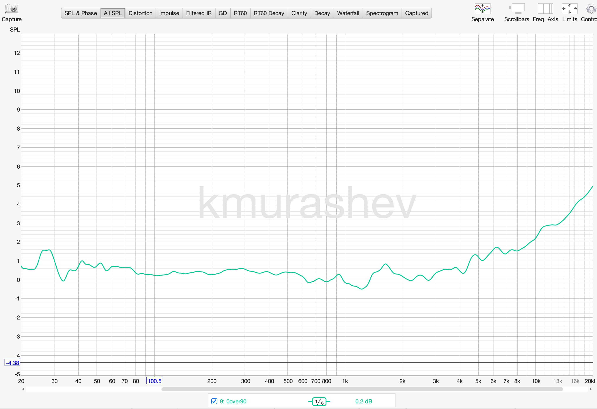
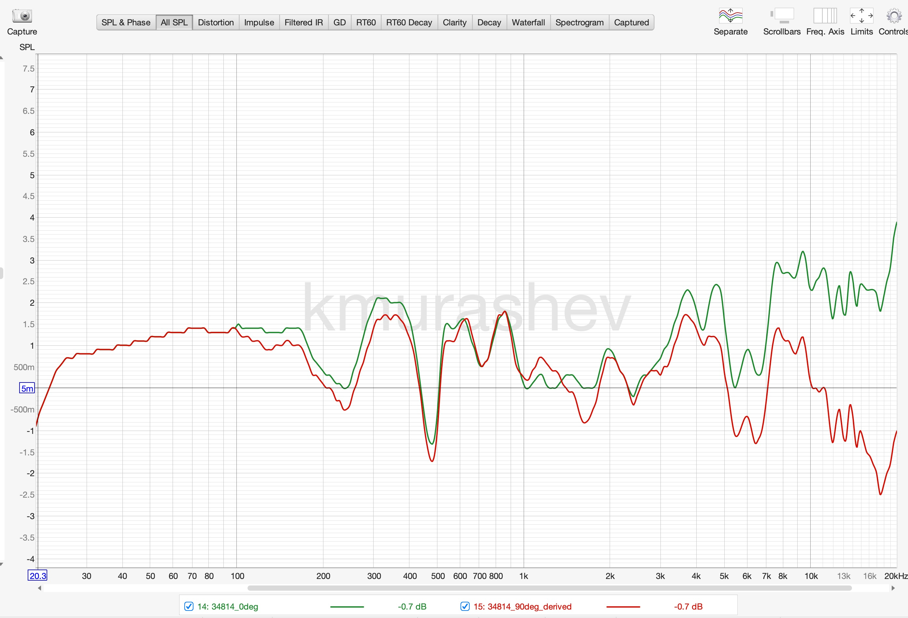
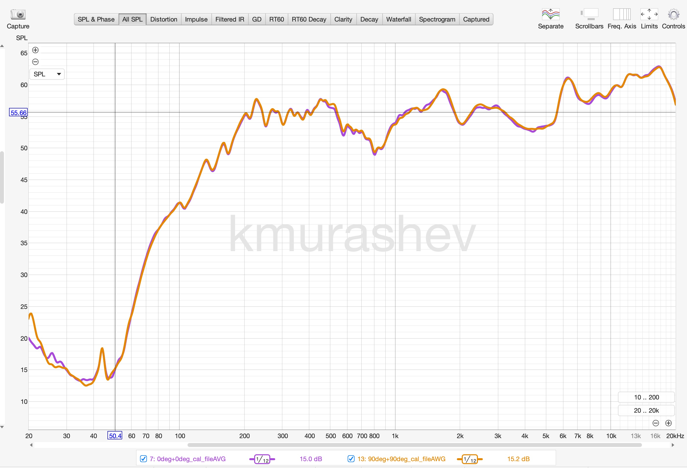

# Dayton Audio EMM-6 — 90° Calibration File

The Dayton Audio EMM-6 measurement microphone ships with an individual calibration file for 0° (on-axis) incidence only. However, many real-world measurement scenarios — such as car audio system tuning — require a 90° (random/diffuse-field) calibration, where the microphone is pointed upward and sound arrives from the side. Without a proper 90° calibration file, high-frequency measurements can be off by several dB due to the microphone's directional response.

This project derives a 90° calibration file from the original 0° calibration using a pair of measurements taken with [REW (Room EQ Wizard)](https://www.roomeqwizard.com/).

## How It Was Done

1. **Two measurements of the same source** — a pink noise signal was measured twice with the EMM-6, using the original 0° calibration file applied in REW:
   - First measurement: microphone pointed directly at the source (0°)
   - Second measurement: microphone at 90° to the source (sideways)

2. **Extracting the directional difference** — in REW, the Trace Arithmetic function (A / B) was used to divide the 0° measurement by the 90° measurement. This produces a frequency-dependent dB curve representing how the microphone's sensitivity differs between the two angles.

   

3. **Applying the correction** — the exported difference curve (`0over90_100hz+.txt`) was subtracted from a copy of the original 0° calibration file using the `adjust-cal` script. The correction is applied from 100 Hz upward, since the microphone's directional behavior is negligible at low frequencies and the measurement data below that range is unreliable.

## Results

### 0° vs 90° calibration curves

The original 0° calibration (green) and the derived 90° calibration (red). The curves diverge above ~1 kHz as expected, with the 90° file compensating for the off-axis roll-off.



### Verification: measurements with derived calibration

Both measurements of the same source loaded with their respective calibration files. The traces closely overlap, confirming the derived 90° calibration is working correctly.



## Setup

```bash
uv sync
```

## Usage

Subtract interpolated correction values from a calibration file:

```bash
# Using the CLI entry point
uv run adjust-cal <calibration_file> <reference_file> <start_freq> [--fade-in]

# Or directly with Python
python3 emm6/adjust_cal.py <calibration_file> <reference_file> <start_freq> [--fade-in]
```

### Arguments

- `calibration_file` — file to adjust (overwritten in place)
- `reference_file` — reference correction data (e.g. `0over90_100hz+.txt`)
- `start_freq` — frequency (Hz) at which full correction begins

### Options

- `--fade-in` — linearly fade correction from 20 Hz (0%) to `start_freq` (100%). Without this flag, frequencies below `start_freq` are left intact.

### Example

```bash
uv run adjust-cal 34814_90deg.txt 0over90_100hz+.txt 100
uv run adjust-cal 34814_90deg.txt 0over90_100hz+.txt 60 --fade-in
```

## Files

| File | Description |
|------|-------------|
| `34814_0deg.txt` | Original 0° calibration file (from Dayton Audio) |
| `34814_90deg.txt` | Derived 90° calibration file |
| `0over90_100hz+.txt` | REW trace arithmetic export (0° / 90° difference) |
